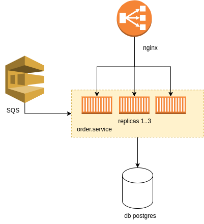
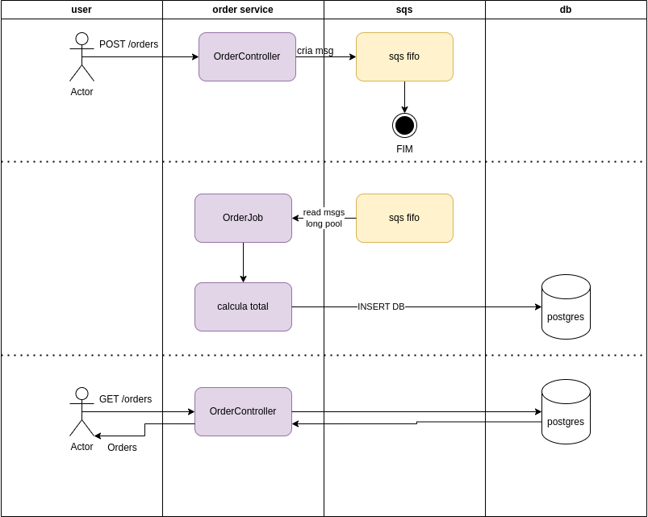
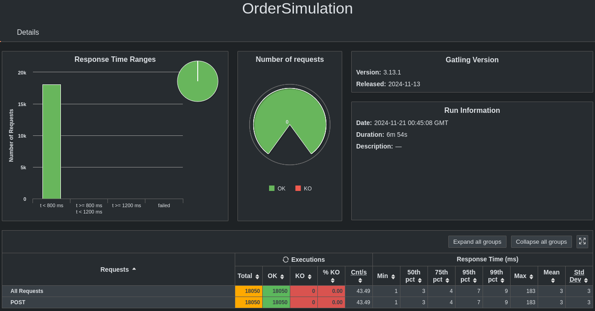

# gerenciamento-pedidos

#### Arquitetura AS-IS



#### Fluxograma



## Teste de performance



## Rodando local

1. Subindo infra, fila sqs e db.

```shell
docker compose up
```

2. Subindo apps:

```shell
docker compose -f docker-compose-lb.yaml up
```

## Testando via nginx (load balancer)

1. POST Orders

```shell
curl --request POST \
  --url http://localhost:9999/v1/orders \
  --header 'Content-Type: application/json' \
  --header 'User-Agent: insomnia/10.0.0' \
  --data '{
	"created_by": "Eduardo",
	"origin": "External-A",
	"items": [
		{
			"prodcut": "umidificador de ar",
			"price": 234.56,
			"quantity": 2
		}
	]
}'
```

2. GET oders

```shell
curl --request GET \
  --url 'http://localhost:9999/v1/orders?page=40&size=100' \
  --header 'Content-Type: application/json' \
  --header 'User-Agent: insomnia/10.0.0'
```
